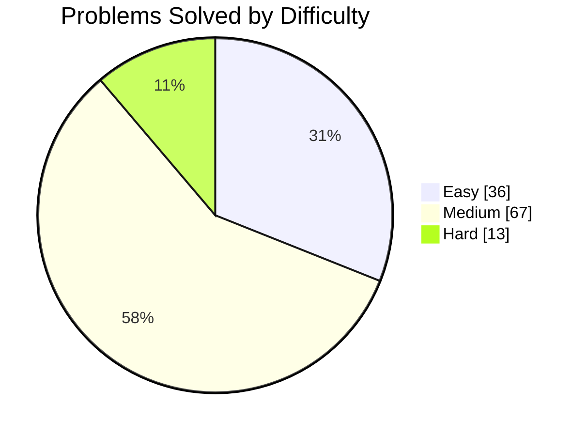

<h1 align="center">🧩 Pankaj's LeetCode Journey</h1>

<p align="center">
  Solving problems in <b>C++</b> to build strong DSA fundamentals, one submission at a time.
</p>

<p align="center">
  <a href="https://leetcode.com/u/Pankaj_1001/"></a>
  <a href="https://github.com/Pankajkr-1"></a>
  <a href="https://linkedin.com/in/pankaj-kumar-65159a389"></a>
</p>

---

## 📊 Stats at a Glance

<p align="center">
  
</p>

| Metric | Value |
|--------|-------|
| ✅ Problems solved | **116** |
| 🟢 Easy | **36** |
| 🟡 Medium | **67** |
| 🔴 Hard | **13** |
| 📝 Submissions (past year) | **194** |
| 📅 Total active days | **51** |
| 🔥 Max streak | **38 days** |
| 🎖️ Latest badge | **50 Days Badge 2026** |
| 💻 Language | **C++** |



More than half of my solves are Medium, so most of my practice goes into problems that need a real idea, not just implementation.

---

## 🎯 Topics I've Practiced

| Level | Topic | Solved |
|-------|-------|--------|
| 🔴 Advanced | Dynamic Programming | 14 |
| 🔴 Advanced | Backtracking | 13 |
| 🔴 Advanced | Monotonic Stack | 8 |
| 🟡 Intermediate | Hash Table | 21 |
| 🟡 Intermediate | Binary Search | 19 |
| 🟡 Intermediate | Math | 15 |
| 🟢 Fundamental | Array | 64 |
| 🟢 Fundamental | String | 25 |
| 🟢 Fundamental | Two Pointers | 20 |

---

## 🛠️ Tech


---

## 🧠 How I Approach a Problem

1. **Understand**: read the statement, constraints, and work through examples by hand
2. **Brute force**: write the simplest correct solution first
3. **Optimize**: find the bottleneck and pick the right data structure or pattern
4. **Analyze**: note time and space complexity
5. **Test**: check edge cases (empty input, duplicates, overflow, single element)
6. **Revisit**: come back to hard problems after a few days

---

## 📁 Repository Structure

```
├── Easy/
│   ├── 0001-two-sum.cpp
│   └── ...
├── Medium/
│   └── ...
├── Hard/
│   └── ...
└── README.md
```

Every solution file starts with a short header comment:

```cpp
// Problem : <number>. <title>
// Link    : https://leetcode.com/problems/<slug>/
// Approach: <one-line idea>
// Time    : O(...)   Space: O(...)
```

---

## 📈 Goals

- [x] Earn the 50 Days Badge
- [ ] Reach 200 problems solved
- [ ] Solve more Hard problems, especially DP and graphs
- [ ] Take part in weekly contests
- [ ] Earn the 100 Days Badge

---

## 📫 Connect

- 🧩 LeetCode: [Pankaj_1001](https://leetcode.com/u/Pankaj_1001/)
- 🐙 GitHub: [Pankajkr-1](https://github.com/Pankajkr-1)
- 💼 LinkedIn: [pankaj-kumar-65159a389](https://linkedin.com/in/pankaj-kumar-65159a389)

---

<p align="center">⭐ If this helped you, consider starring the repo!</p>

<!---LeetCode Topics Start-->
# LeetCode Topics
## Array
|  |
| ------- |
| [0004-median-of-two-sorted-arrays](https://github.com/Pankajkr-1/leetcode-solutions/tree/master/0004-median-of-two-sorted-arrays) |
## Binary Search
|  |
| ------- |
| [0004-median-of-two-sorted-arrays](https://github.com/Pankajkr-1/leetcode-solutions/tree/master/0004-median-of-two-sorted-arrays) |
## Divide and Conquer
|  |
| ------- |
| [0004-median-of-two-sorted-arrays](https://github.com/Pankajkr-1/leetcode-solutions/tree/master/0004-median-of-two-sorted-arrays) |
<!---LeetCode Topics End-->